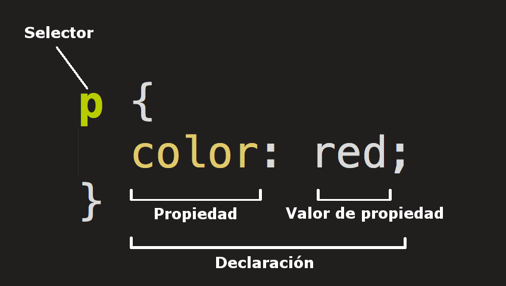

# Hojas de Estilo en Cascada (CSS)
[Hojas de Estilo en Cascada o CSS](https://www.w3.org/Style/CSS/#specs) (siglas en inglés de *Cascading Style Sheets*) es un lenguaje de diseño gráfico para describir la presentación de un documento escrito en un lenguaje de marcas (ej. HTML). Permite especificar aspectos de diseño como colores, tipos y tamaños de letra, márgenes, alineamientos y muchos otros.

CSS permite manejar la presentación separadamente del contenido, lo que brinda una mayor una flexibilidad en el diseño. Por ejemplo, varios archivos HTML pueden compartir una misma presentación al hacer referencia a un mismo archivo CSS. También posibilita un despliegue diferenciado de acuerdo a los tipos y tamaños de pantallas, en conjunto con HTML5.

Al igual que HTML, CSS es un estándar de W3C. Fue propuesto por Håkon Wium Lie, quien trabajaba en CERN con Tim Berners-Lee, en 1994.

# Ejemplos de uso de CSS
- [CSS Zen Garden: The Beauty of CSS Design](http://www.csszengarden.com/)
- [En CodePen: Intro Front-End Holy Trinity](https://codepen.io/mongeauc/pen/gPVoXd)

# Conceptos básicos
## Reglas CSS
Las hojas de estilo se basan en **reglas CSS**, como la que se muestra en la figura 1.

<figure>
  
  <figcaption>
    <strong>Figura 1.</strong> Componentes de una regla CSS. Fuente: <a href="https://developer.mozilla.org/es/docs/Learn/Getting_started_with_the_web/CSS_basics">MDN Web Docs.</a>
  </figcaption>
</figure>  

Los componentes de una regla CSS son:  

1. **El selector**: es el elemento, o elementos HTML, para los que aplica la regla.
2. **La propiedad**: es la característica del elemento HTML (ej. color, tamaño, tipo de letra) a la que se desea aplicar el estilo.
3. **El valor de la propiedad**: es el valor que se le asigna a la propiedad (ej. rojo, azul, etc. para el color).
4. **La declaración**: es la combinación de propiedad y valor de la propiedad.

Entre las llaves (```{}```) pueden especificarse varias declaraciones, las cuales deben separarse con punto y coma (```;```). Aún cuando haya solo una declaración, se recomienda usar el punto y coma, por legibilidad.

Los siguientes son ejemplos de reglas CSS:

```css
p {
    color:red;
}

body {
    background-color:black;
    color:white;
    font-family:Arial;
    margin:0 4px 0 0;
    border:12px solid;
}

h1,h2 {
    color:blue;
    background-color:yellow;
}
```
Pueden encontrarse listas y ejemplos de uso de las propiedades CSS en:
- [CSS Reference - MDN](https://developer.mozilla.org/en-US/docs/Web/CSS/Reference)
- [CSS Reference - W3 Schools](https://www.w3schools.com/cssref/)


### Cómo especificar reglas y propiedades CSS
Un navegador web busca reglas y propiedades CSS en el siguiente orden de prioridad:

1. En su configuración por defecto.
2. En archivos CSS (.css).
3. En el elemento ```style```.
4. En elementos HTML individuales (ej. ```body```, ```h1```, ```table```, ...).

#### En elementos HTML individuales
Se hace a través del atributo global [style](https://developer.mozilla.org/es/docs/Web/HTML/Global_attributes/style), como en el siguiente ejemplo:

```html
<h1 style="color:blue;">Encabezado estilizado</h1>
```

Esta forma no separa el contenido del estilo por lo que, en general, no es recomendada.

#### En el elemento ```style```

El elemento [style](https://developer.mozilla.org/es/docs/Web/HTML/Element/style) se ubica, por lo general, dentro del elemento ```head```.

```html
<head>
    <title>Ejemplo de reglas CSS especificadas en el elemento <style></title>
    <style>
        h1 {
            color:blue;
        }
    </style>
</head>
```

#### En archivos CSS (.css)
En la sección ```head``` del archivo HTML que va a usar los estilos, debe incluirse un elemento de tipo [link](https://developer.mozilla.org/es/docs/Web/HTML/Element/link), como se ejemplifica seguidamente:

```html
<link rel="stylesheet" href="css/estilos.css">
```

Ejemplo de contenido de ```css/estilos.css```:

```css
p {
    color:red;
    font-size:200%;
}

h1 {
    background-color:yellow;
}  

body {
    background-color:black;
    color:white;
    margin:0 4px 0 0;
    border:12px solid;
}
```

**Ejercicios**
1. Con base en la [tarea 01](https://tpb729-desarrollosigweb-2021.github.io/tarea-01-html/), construya un sitio web en [GitHub Pages](https://pages.github.com/) sobre especies de felinos de Costa Rica.  
a. Cree un archivo llamado *index.html* con información general sobre los felinos de Costa Rica (puede usar el de la tarea).  
b. Cree un archivo llamado *panhera-onca.html* con información sobre esa especie. Incluya, al menos, el título, un encabezado, un párrafo y una imagen (sugerencia: use contenido de Wikipedia).  
c. Cree un archivo llamado *css/estilos.css* que, para ambos archivos, especifique mediante CSS, por lo menos: el tipo y tamaño de letra, el color de fondo y el color de los encabezados.  
d. Cree un archivo llamado *puma-concolor.html* con información sobre esa especie. Incluya, al menos, el título, un encabezado, un párrafo y una imagen (sugerencia: use contenido de Wikipedia). Aplique aquí también los estilos de *css/estilos.css*.  
e. En cada página, cree una barra de navegación que permita navegar a las otras dos páginas. Para esto utilice el elemento [nav](https://developer.mozilla.org/es/docs/Web/HTML/Element/nav).  

## Categorías de selectores
### Selectores de tipo
Aplican para todos los elementos HTML de cierto tipo (ej. ```h1```, ```h2```, ```p```, ```table```).

**Código CSS**
```css
p {
    color:blue;
}
```

**Código HTML**
```html
<p>
    Lorem ipsum dolor sit amet, consectetur adipiscing elit. Morbi non consequat augue, vel condimentum velit
</p>
```

### Selectores de clase
Aplican para elementos HTML con un valor específico en el atributo ```class```. En la sintaxis de CSS, los selectores de clase se definen con un punto (.) seguido del nombre de la clase.

**Código CSS**  
Se definen la clase "azul" y la clase "rojo".
```css
.azul {
    color:blue;
}

.rojo {
    color:blue;
}
```

**Código HTML**  
Se aplican las clases "azul" y "rojo" en varios elementos HTML.
```html
<p class="rojo">
    Lorem ipsum dolor sit amet, consectetur adipiscing elit. Donec at lacus nibh. Mauris volutpat malesuada ultrices.
</p>

<p class="azul">
    Ut aliquet nulla a ornare laoreet. Cras sed eros faucibus, dignissim odio quis, dictum ante. Proin hendrerit lacinia lectus et condimentum.
</p>

<p class="rojo">
    Phasellus commodo velit quam, et gravida felis molestie et. Quisque luctus cursus euismod. Aenean semper pellentesque dolor.
</p>
```

### Selectores de ID
Aplican para el elemento que posea un valor específico en el atributo ```id```. Estos selectores se denotan por un signo de numeral (#) seguido por el id del elemento.

**Código CSS**  
Se definen las clases "arial" y "times".
```css
#arial {
    font-family: Arial;
}

#times {
    font-family: Times;
}
```

**Código HTML**  
Se aplican las clases "arial" y "times" en varios elementos HTML.
```html
<p id="arial">
    Lorem ipsum dolor sit amet, consectetur adipiscing elit. Donec at lacus nibh. Mauris volutpat malesuada ultrices.
</p>

<p id="times">
    Ut aliquet nulla a ornare laoreet. Cras sed eros faucibus, dignissim odio quis, dictum ante. Proin hendrerit lacinia lectus et condimentum.
</p>
```
